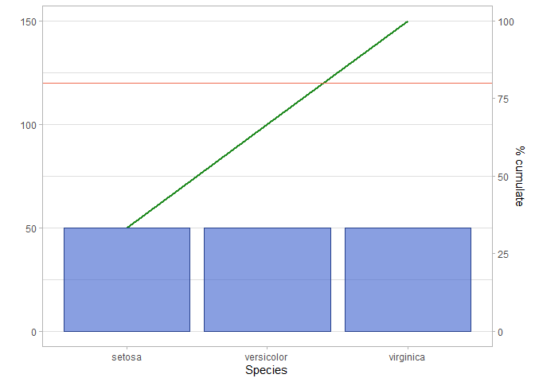

<!-- README.md is generated from README.Rmd. Please edit that file -->

# discoverr

The goal of discoverr is to automate the first data discovery steps.

## Installation

You can install the released version of discoverr from
[CRAN](https://CRAN.R-project.org) with:

``` r
# install.packages("devtools")
devtools::install_github("edo91/prettifier")
```

## Example

TThis is a basic example which shows you how to solve a common problem:

``` r
library(discoverr)
#> Registered S3 method overwritten by 'GGally':
#>   method from   
#>   +.gg   ggplot2
## basic example code
```

``` r
plot_var(iris)
#> Loading required package: ggfancy
```



``` r
plot_2var(iris)
```


